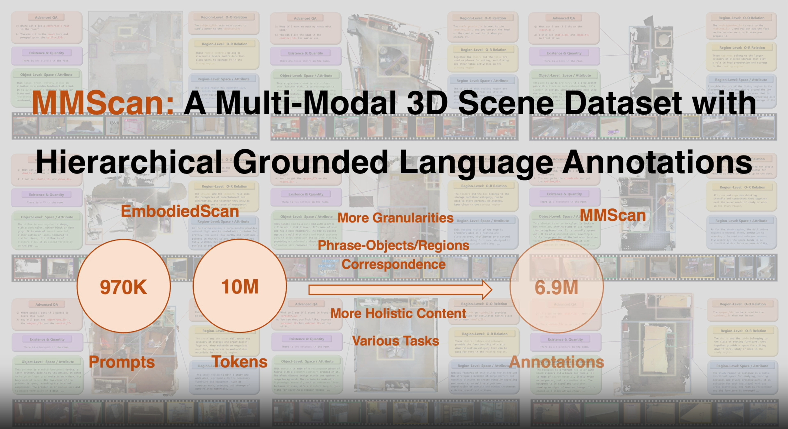

<br>
<p align="center">
<h1 align="center"><strong>MMScan: A Multi-Modal 3D Scene Dataset with Hierarchical Grounded Language Annotations</strong></h1>
  
  </p>
</p>


<div id="top" align="center">

[](https://arxiv.org/abs/2312.16170)
[](./assets/MMScan.pdf)
[](https://tai-wang.github.io/mmscan)

</div>

## 🤖 [Demo](https://tai-wang.github.io/mmscan)


[](https://tai-wang.github.io/mmscan)

<!-- contents with emoji -->

## 📋 Contents

1. [About](#-about)
2. [Getting Started](#-getting-started)
3. [Model and Benchmark](#-model-and-benchmark)
4. [TODO List](#-todo-list)


## 🏠 About

<!--  -->

<div style="text-align: center;">
    
</div>
     
With the emergence of LLMs and their integration with other data modalities,
 multi-modal 3D perception attracts more attention due to its connectivity to the
 physical world and makes rapid progress. However, limited by existing datasets,
 previous works mainly focus on understanding object properties or inter-object
 spatial relationships in a 3D scene. To tackle this problem, this paper builds <b>the
 first largest ever multi-modal 3D scene dataset and benchmark with hierarchical
 grounded language annotations, MMScan.</b> It is constructed based on a top-down
 logic, from region to object level, from a single target to inter-target relation
ships, covering holistic aspects of spatial and attribute understanding. The overall
 pipeline incorporates powerful VLMs via carefully designed prompts to initialize
 the annotations efficiently and further involve humans’ correction in the loop to
 ensure the annotations are natural, correct, and comprehensive. Built upon exist
ing 3D scanning data, the resulting multi-modal 3D dataset encompasses 1.4M
 meta-annotated captions on 109k objects and 7.7k regions as well as over 3.04M
 diverse samples for 3D visual grounding and question-answering benchmarks. We
 evaluate representative baselines on our benchmarks, analyze their capabilities in
 different aspects, and showcase the key problems to be addressed in the future.
 Furthermore, we use this high-quality dataset to train state-of-the-art 3D visual
 grounding and LLMs and obtain remarkable performance improvement both on
 existing benchmarks and in-the-wild evaluation. 

## 🚀 Getting Started: 

### Installation

1. Clone Github repo.

    ```shell
    git clone git@github.com:rbler1234/MMScan.git
    cd MMScan
    ```

### Data Preparation

1. Download the Embodiedscan and MMScan annotation. (Fill in the [form](https://docs.google.com/forms/d/e/1FAIpQLScUXEDTksGiqHZp31j7Zp7zlCNV7p_08uViwP_Nbzfn3g6hhw/viewform) to apply for downloading)

    Unzip the files and put them under `MMScan_data/`.
    ```
    MMScan_data
    ├── embodiedscan-split
    ├── MMScan-beta-release
    ```
2. Prepare the point clouds files.

    Please refer to the [guide](data_preparation/README.md) here.

## 👓 MMScan API Tutorial

You can import MMScan API in this way:
```bash
    sys.path.append('path/to/MMScan')

    (1) the dataloader tool
    MMScan_dataloder = importlib.import_module('MMScan_tool.mmscan').EmbodiedScan

    (2) the evaluator tool
    MMScan_{}_evaluator = importlib.import_module('MMScan_tool.evaluator.{}_evlation').{}_Evaluator
```

#### MMScan DataLoader 

We offer a tool that allows you to easily obtain the data required by the models in the MMScan task. 
```bash
    my_loader = MMScan_dataloder(split='train')
    my_loader.set_lang_task("MMScan-QA",ratio=1.0)
    # the train split of MMScan QA task, the down sample ratio is 1.0
    print(my_loader[100])
```

You can conveniently use `__get_item__` to access them. Each item is a dictonary containing the following keys:

( 0 ) Index of this sample

( 1 ) 3D modality
```
        "ori_pcds" (tuple[tensor]): the raw data read from the pth file.

        "pcds" (np.ndarray):  the point cloud data of the scan, 
                            [n_points, 6(xyz+rgb)]

        "instance_labels" (np.ndarray): the instance id of each point, 
                                        [n_points,1]

        "class_labels" (np.ndarray): the class id of each point, 
                                        [n_points,1]

        "bboxes" (dict):  bounding boxes info in the scan 
                        { object_id : 
                            {"type": object_type (str),  
                            "bbox": 9 DoF box (np.ndarray), 
                        ...}}
```
( 2 ) Lanuage modality
```
        "sub_class": the category of this sample.
        "ID": the id of this sample.
        "scan_id": the scan id where is the sample.

        for VG task
        "target_id" (list[int]) : The target objects id.
        "text" (str): The grounding text.
        "target" (list[str]) : The target objects type.
        "anchors" (list[str]) : The anchor objects type.
        "anchor_ids" (list[int]) : The anchor objects id.
        "tokens_positive" (dict) : Where the object mentioned in the text
    

        for QA task 
        "question" (str): the quseion.
        "answers" (list[str]): the answers.
        "object_ids" (list[int]): objects id mentioned in the questions.(gt)
        "object_names" (list[str]): objects type mentioned in the questions.(gt)
        "input_bboxes_id" (list[int]):  the input bounding boxes id (objects id).
        "input_bboxes" (list[nd.narray]):  the input bounding boxes (9 DoF).

```

( 3 ) 2D modality

    TBD


#### MMScan  Evaluator
We offer a tool that allows you to easily evaluate the model output in the MMScan task. 

(1) Visual grounding evaluator

for visual grounding task, our evaluator calculate the metric AP, AR, multi-topk.
```bash
    # whether to show the progress
    my_evaluator = MMScan_VG_evaluator(verbose=True)
    # the input to the evaluator should be in a certain format.
    my_evaluator.update(model_output)
    metric_dict = my_evaluator.start_evaluation()
    # Optional 1, get the sample-level result
    print(my_evaluator.records)
    # Optional 1, get the sample-level result
    print(my_evaluator.print_result())

    # You should reset the evaluator!
    my_evaluator.reset()
```
the input to the evaluator should be in a certain format:
```
        "pred_scores" (tensor/ndarray): the confidence for each pred.
                                        (num_pred,1)

        "pred_bboxes"/"gt_bboxes" (tensor/ndarray): the list of 9 DoF box.
                  Support for two input mode:
                    1. 9-dim 9 DoF bounding box (num_pred/gt, 9)
                    2. center, size and rot matrix 
                    ("center": (num_pred/gt, 3),
                      "size" : (num_pred/gt, 3),
                       "rot" : (num_pred/gt, 3, 3))
        "subclass": the subclass in the VG samples.
        "index" :
```
(2) Question Answering evaluator

for question answering task, our evaluator calculate the metric Bleu-X, Metor, CiDer, Spice, Simcse, Sbert, EM, Refine EM
```bash
    # whether to show the progress
    my_evaluator = MMScan_QA_evaluator(model_config={},verbose=True)
    # the input to the evaluator should be in a certain format.
    my_evaluator.update(model_output)
    metric_dict = my_evaluator.start_evaluation()
    # Optional 1, get the sample-level result
    print(my_evaluator.records)
 
    # You should reset the evaluator!
    my_evaluator.reset()
```
the input to the evaluator should be in a certain format:
```
        "qusetion"(str)
        "pred" (list[str]): the prediction, length should be equal 1.
        "gt" (list[str]): the prediction, length should be larger than 1.
        "ID": the ID in the QA samples, should be unique.
        "index" 
```

(3) GPT evaluator
### Models


## 📝 TODO List

- \[ \] Python environment and more convenient way to install and invoke
- \[ \] Explicit Readme.md for each model and clean the model's code
- \[ \] Visual Grounding metric update
- \[ \] Captioning benchmark update
- \[ \] Full release and further updates.
